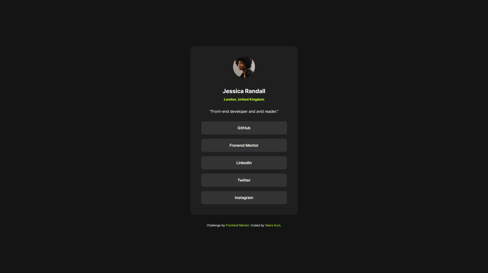

# Frontend Mentor - Social links profile solution

This is a solution to the [Social links profile challenge on Frontend Mentor](https://www.frontendmentor.io/challenges/social-links-profile-UG32l9m6dQ). 
## Table of contents

- [Overview](#overview)
  - [Screenshot](#screenshot)
  - [Links](#links)
  - [Built with](#built-with)
  - [Note](#note)

## Overview

### Screenshot

### Links

- Solution URL: [https://www.frontendmentor.io/solutions/social-links-profile-solution-UYzQ5ImM8A]
- Live Site URL: [https://veeraarun.github.io/Frontend-Mentor__Social-links-profile-solution/]

### Built with

- Semantic HTML5 markup
- CSS custom properties
- Flexbox
- CSS root pseudo class

## Note
Feel free to explore the files, and any feedback or contributions to improve the site are always welcome!
